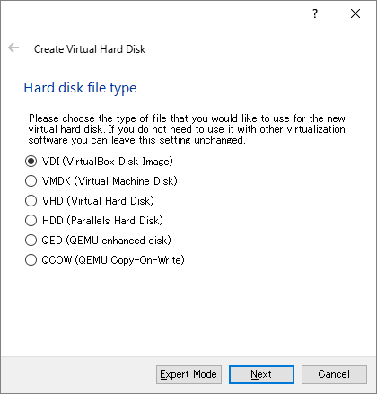
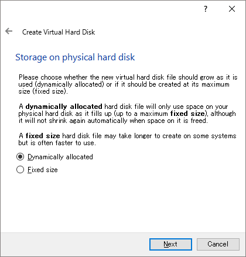
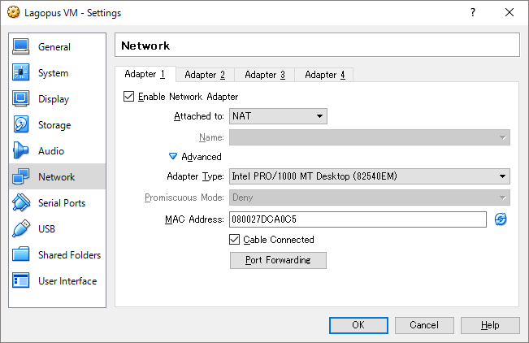
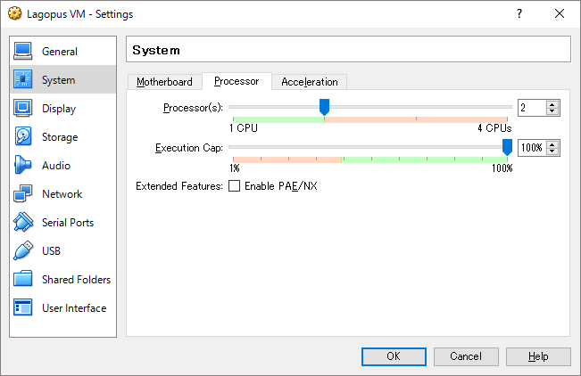
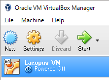

.. _ref_virtualbox:

Appendix: Installing Lagopus vswitch on VirtualBox VM
=============================================
This section describes how to install Lagopus on VirtualBox VM.

Software Versions
-----------------
* Lagopus software switch: `Lagopus software switch 0.2.3`_
* VirtualBox: 5.0.14r105127
* Host OS: Windows 10
* Guest OS: Linux `Ubuntu Server 16.06 LTS`_

.. _Lagopus software switch 0.2.6: https://github.com/lagopus/lagopus/releases/tag/v0.2.6
.. _Ubuntu Server 16.04 LTS: http://www.ubuntu.com/download/server

About VirtualBox
----------------
ORACLE VirtualBox is x86 and AMD64/Intel64 virtualization product which is freely available as Open Source Software under the terms of the GNU General Public License (GPL) version 2.

You could run VirtualBox on host OS running Windows, Linux, Macintosh, and Solaris.

Refer to the `VirtualBox web site`_ For more information about VirtualBox.

.. _VirtualBox web site: https://www.virtualbox.org/

Download and Install VirtualBox
-------------------------------
* Download VirtualBox installation image from: https://www.virtualbox.org/wiki/Downloads
* Install VirtualBox.

Create VM
---------
* Start "Oracle VM VirtualBox Manager" (Management GUI)
* Click "New"
.. image:: images/virtualbox/virtualbox-001.png
* Enter Name (=any), Type (=Linux), Version (=Ubuntu (64-bit)).
.. image:: images/virtualbox/virtualbox-002.png
* Set Memroy Size (>=2GB recommended. 3GB in this example.)
.. image:: images/virtualbox/virtualbox-003.png
* Set Hard disk size (default = 8.00 GB)
.. image:: images/virtualbox/virtualbox-004.png
* Set Hard disk file type: default = VDI (VirtualBox Disk Image)

* Set Storage on physical hard disk: default = Dynamically allocated.

* Set File location and size: default folder name = Name of the VM you've specified.
.. image:: images/virtualbox/virtualbox-007.png
* Click "Create" and VM will be created.

VM Network Setting
------------------

Add two (2) new adapters as data ports used by Lagopus.
^^^^^^^^^^^^^^^^^^^^^^^^^^^^^^^^^^^^^^^^^^^^^^^^^^^^^^^
* Adapter 1 (available by default)

  * management port (Internet access, SSH from Host OS)

* Adapter 2/3 (new)

  * Lagopus data ports

Steps:

* Select VM you just created. Right click and select "Settings"
.. image:: images/virtualbox/virtualbox-008.png
* Select "Network" -> "Adapter 2" and configure below. Do the same for "Adapter 3" as well.

  * Enable Network Adapter: enable
  * Attached to: Internal Network
  * Name: intnet02 (intnet03 for Adapter 3)
  * Advanced: Adapter Type: Intel PRO/1000 MT Server (82545EM)
  * Advanced: Promiscuous Mode: Allow All
.. image:: images/virtualbox/virtualbox-009.png

Note: NIC supported by DPDK is listed here: http://dpdk.org/doc/nics

Configure "Port Forwarding" to enable SSH from host to guest.
^^^^^^^^^^^^^^^^^^^^^^^^^^^^^^^^^^^^^^^^^^^^^^^^^^^^^^^^^^^^^
* Select "Network" -> "Adapter 1"
* Click "Advanced: Port Forwarding"

* Click "+" mark on right. Set below to newly created row.

  * Name: rule_name you like. ex: ssh
  * Host Port: port used on Host OS. ex: 2201
  * Guest Port: 22 (SSH)

VM Processor (CPU) Setting
--------------------------
* Select "System" -> Processor" to modify CPU cores to be assigned to the VM.
* 2 or more CPU cores are required when using DPDK.

Install Guest OS (Linux / Ubuntu)
---------------------------------
* Download Guest OS ISO:

  *  `Ubuntu Server 16.06 LTS`_ (ubuntu-16.04-server-amd64.iso)

* Start VM by clicking "Start"

* At "Select start-up disk" diaglog, select ISO you just downloaded and click "Start"
.. image:: images/virtualbox/virtualbox-013.png
* Follow Ubuntu install wizard. A few points to be noted are:

  * Select Primary Network Interface: eth0 (Adapter 1)
  * No automatic updates (for testing purpose to make package predictable)
  * Software installation: OpenSSH server

Once installed, SSH to localhost:<port> where <port> is the "Host port" you configured in "Port Forwarding".

Next Steps
----------
Follow steps in :ref:`ref_installation-rawsocket` or :ref:`ref_installation-dpdk` to continue Lagopus software switch and configuration.
