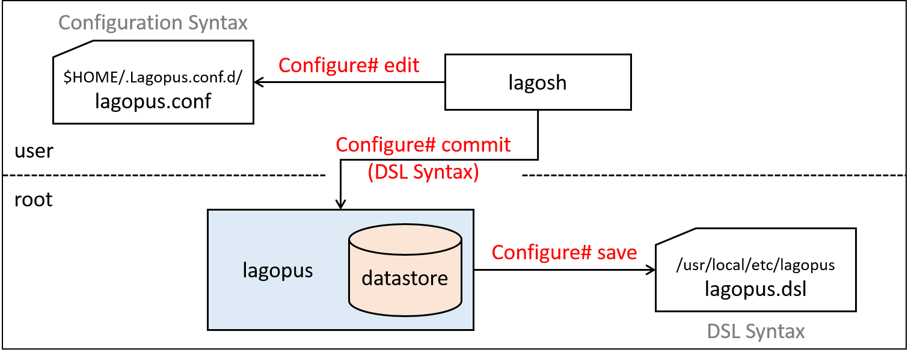
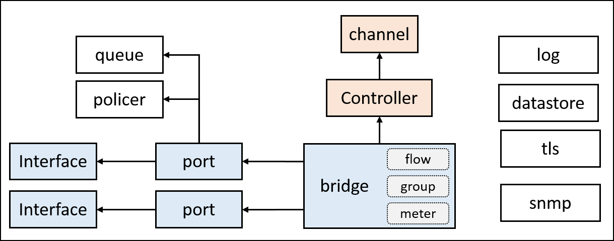

.. _ref_datastore:

Lagopus software switch datastore and DSL syntax
===================================================================

This section describes how Lagopus software switch stores configuration data in it's datastore at runtime, and explain each parameters used in DSL syntax configuration file which is loaded to datastore at boot time.

There are two types of syntax (format) used to describe configuration of Lagopus software switch.
Refer to `Configuration syntax types`_ for details about both syntax.

datastore overview
------------------

"Lagopus datastore" is a database where configuration, and other data (ex: flows) used at runtime are stored.

.. image:: images/datastore-overview-01.png

This diagram shows how datastore interacts with configuration files (``lagopus.conf``, ``lagopus.dsl``) and ``lagosh`` command.

* ``$HOME/.lagopus.conf.d/*.conf`` (ex: ``lagopus.conf``) are written in lagosh configuration syntax.
* ``/usr/loca/etc/lagopus/*.dsl`` (ex: ``lagopus.dsl``) are written in DSL syntax.
* Since datastore can only read files in DSL syntax, lagosh will translate ``*.conf`` file to DSL syntax while communicating with lagopus datastore via TCP.
* lagopus will read ``*.dsl`` directly from the file at boot time.

  * Use ``-C filename`` or ``--config filename`` option to specify configuration file. (DSL format)
  * If not specified, lagopus will load ``/usr/loca/etc/lagopus/lagopus.dsl``

lagosh operation and datastore
^^^^^^^^^^^^^^^^^^^^^^^^^^^^^^

Instead of editing ``*.dsl`` file directly, you can edit/commit/save configuration using lagosh.

Refer to :ref:`ref_lagosh` for detailed explanation about lagosh configuration commands.

Examples:

* Start lagosh and enter configuration mode.

  .. code-block:: console

     $ lagosh
     Lagosh> configure
     Configure#

* ``Configure# edit`` will create working file under ``$HOME/.lagopus.conf.d/``

  * edit file in lagosh configuration syntax.

* ``Configure# commit`` will apply changes to lagopus running configuration (datastore).
* ``Configure# save`` will write running configuration to ``/usr/local/etc/lagopus/lagopus.dsl`` in DSL syntax.

Configuration syntax types
--------------------------

There are two types of syntax (format) used to describe configuration of Lagopus software switch.

* configuration syntax

  * Used in ``*.conf`` files.
  * Used when editing via ``lagosh``.

* DSL syntax

  * Used in ``*.dsl`` files.
  * Used by ``lagopus`` and it's ``datastore``.

  "configuration syntax" consists of ``object-name``, ``identifier``, and ``attribute`` ``value`` pair. Some object-name may not have identifier.

  .. code-block:: console

     <object-name>
       [identifier] {
         <attribute value>;
         ...
       }
     }

     # example:
     interface {
             interface01 {
                     type ethernet-rawsock;
                     device eth1;
                     mtu 1500;
                     ip-addr 127.0.0.1;
             }
     }

In "DSL syntax", each line describes single configuration command.

  .. code-block:: console

     <object-name> [identifier] [operation] <-attribute value> ...

     # example:
     interface interface01 create -type ethernet-rawsock -device eth1 -mtu 1500 -ip-addr 127.0.0.1

Refer to `Configurable objects and DSL syntax`_ for details about DSL syntax.

Converting between ``.conf`` and ``.dsl`` syntax
^^^^^^^^^^^^^^^^^^^^^^^^^^^^^^^^^^^^^^^^^^^^^^^^^^^^^^^^^^

By using ``--dsl-encode`` ``--dsl-decode`` option, you can convert between ``.conf`` and ``.dsl`` syntax.

Examples:

* ``.conf`` to ``.dsl``

  .. code-block:: console

     $ head .lagopus.conf.d/lagopus.conf
     log {
             syslog;
             ident lagopus;
             debuglevel 0;
             packetdump "";
     }
     datastore {
             addr 0.0.0.0;
             port 12345;
             protocol tcp;

     $ lagosh --dsl-encode .lagopus.conf.d/lagopus.conf
     log -syslog -ident lagopus -debuglevel 0 -packetdump ""
     datastore -addr 0.0.0.0 -port 12345 -protocol tcp -tls false
     agent -channelq-size 1000 -channelq-max-batches 1000
     ... snip ...

* ``.dsl`` to ``.conf``

  .. code-block:: console

     $ head /usr/local/etc/lagopus/lagopus.dsl
     # all the log objects' attribute
     log -syslog -ident lagopus -debuglevel 0
     log -packetdump ""

     # all the datastore objects' attribute
     datastore -addr 0.0.0.0 -port 12345 -protocol tcp -tls false

     # all the agent objects' attribute
     agent -channelq-size 1000 -channelq-max-batches 1000

     $ lagosh --dsl-decode /usr/local/etc/lagopus/lagopus.dsl
     log {
             syslog;
             ident lagopus;
             debuglevel 0;
             packetdump "";
     }
     datastore {
             addr 0.0.0.0;
             port 12345;
             protocol tcp;
             tls false;
     }
     agent {
             channelq-size 1000;
             channelq-max-batches 1000;
     }
     ... snip ...

Configurable objects and DSL syntax
------------------------------------

This diagram shows overview of configurable objects of lagopus.
Attributes of major configurable objects are described below.

log object
^^^^^^^^^^

"log object" sets log output destination and level.

.. code-block:: console

   log <attribute value> ...

   # example:
   log -syslog -ident lagopus -debuglevel 0
   log -file /home/user/lagopus.log -debuglevel 0

* ``-syslog`` Set log destination to syslog. takes no value.
* ``-file`` Set log destination to file.

  * You can set two lines each specifying ``-syslog`` and ``-file``, but cannot use both attributes in one line.

* ``-ident`` Only with ``-syslog``. char string ident used in syslog entry. default ``lagopus``.
* ``-debuglevel`` Takes value of ``0 ~ MAXIMUM_DBGLVL(UINT16_MAX)``. default ``0``.

  * check ``lagopus_msg_debug`` in source code for usage of debuglevel.

datastore object
^^^^^^^^^^^^^^^^

"datastore object" sets parameters to connect to lagopus datastore.

.. code-block:: console

   datastore <attribute value> ...
   # example:
   datastore -addr 0.0.0.0 -port 12345 -protocol tcp -tls false

* ``-addr`` address of the datastore process.
* ``-port`` tcp port the datastore process listens to.
* ``-protocol`` protocol used to connect to datastore. ``tcp`` or ``tcp6``.
* ``-tls`` use TLS or not. ``false`` or ``true``.

tls object
^^^^^^^^^^
"tls object" sets parameters related to TLS.

.. code-block:: console

   tsl <attribute value> ...

   # example:
   tls -cert-file /usr/local/etc/lagopus/catls.pem -private-key /usr/local/etc/lagopus/key.pem -certificate-store /usr/local/etc/lagopus -trust-point-conf /usr/local/etc/lagopus/check.conf

* ``-cert-file`` location of cert file. (.pem)
* ``-private-key`` location of key file. (.pem)
* ``-certificate-store`` location to store certificates.
* ``-trust-point-conf`` location of trust-point-conf file. (.conf)

policer-action object
^^^^^^^^^^^^^^^^^^^^^
"policer-action object" sets type of policer action.

.. code-block:: console

   policer-action <policer-action-identifier> create <attribute value>

   # example:
   policer-action pa01 create -type discard

* ``policer-action-identifier`` Name to identify the policer-action
* ``-type`` Type of policer action. Currently type ``discard`` is only availble.

policer object
^^^^^^^^^^^^^^
"policer object" sets policer parameters.

.. code-block:: console

   policer <policer-identifier> create <attribute value> ...

   # example:
   policer policer01 create -action pa01 -bandwidth-limit 10000 -burst-size-limit 11000 -bandwidth-percent 20

* ``policer-identifier`` Name to identify the policer.
* ``-action`` Name of policer-action associated with the policer.
* ``-bandwidth-limit``
* ``-burst-size-limit``
* ``-bandwidth-percent``

queue object
^^^^^^^^^^^^
"queue object" sets parameters of queues used by OpenFlow ``set-queue`` action.

.. code-block:: console

   queue <queue-identifier> create <attribute value> ...

   # example:
   queue queue01 create -type two-rate -id 1 -priority 50

* ``queue-identifier`` Name to identify the queue.
* ``-type`` Type of queue. ``single-rate`` or ``two-rate``.
* ``-id`` ID used in OpenFlow ``set-queue`` action.
* ``-priority`` Nonnegative integer, ``0 ~ 65535(UINT16_MAX)``.

  * Packets will be scheduled on each port using weighted round robin based on ratio of priority of queues.

* ``-color`` Behavior based on color. ``color-aware`` or ``color-blind``.
* Optional options for both ``single-rate`` and ``two-rate``

  *  ``-committed-burst-size`` CBS in bytes.
  *  ``-committed-information-rate`` CIR in bps.

* Optional option for ``single-rate``

  *  ``-excess-burst-size`` EBS in bytes.

* Optional options for ``two-rate``

  *  ``-peak-burst-size`` PBS in bytes.
  *  ``-peak-information-rate`` PIR in bps.

interface object
^^^^^^^^^^^^^^^^
"interface object" sets parameters of interface.

.. code-block:: console

  interface <interface-identifier> create <attribute value> ...

  # example:
  interface interface01 create -type ethernet-rawsock -device eth1 -mtu 1500 -ip-addr 127.0.0.1
  interface interface01 create -type ethernet-dpdk-phy -port-number 0

* ``interface-identifier`` Name to identify the interface.
* ``-type`` Type of the interface. One of below.

  * ``ethernet-dpdk-phy``
  * ``ethernet-dpdk-vdev``
  * ``ethernet-rawsock``
  * ``gre``
  * ``nvgre``
  * ``vxlan``
  * ``vhost-user``

* ``-device`` Name of the device associated with the interface. PCI ID for dpdk.
* ``-port-number`` DPDK port number. Only used by dpdk.
* ``-mtu`` MTU of the interface.
* ``-ip-addr`` IP address of the interface.

.. note::

   Either ``-device`` or ``-port-number`` should be specified per line, not both.

port object
^^^^^^^^^^^
"port object" sets port and interface assosication.

.. code-block:: console

  port <port-identifier> create <attribute value>

  # example:
  port port01 create -interface interface01

* ``port-identifier`` Name to identify the port.
* ``-interface`` interface-identifier assosiated with the port.
* ``-policer`` policer-identifier assosiated with the port.
* ``-queue`` queue-identifier assosiated with the port.

channel object
^^^^^^^^^^^^^^
"channel object" sets parameters of channel used to communicate with OpenFlow controller.

.. code-block:: console

  channel <channel-identifier> create <attribute value> ...

  # example:
  channel channel01 create -dst-addr 127.0.0.1 -dst-port 6633 -local-addr 0.0.0.0 -local-port 0 -protocol tcp

* ``channel-identifier`` Name to identify the channel
* ``-dst-addr`` IP address of the controller
* ``-dst-port`` tcp port number of the controller
* ``-local-addr`` source IP address used when connecting to controller
* ``-local-port`` tcp port used when connecting to controller. ``0`` = automatically assigned.
* ``-protocol`` protocol used when connecting to controller. ``tcp`` or ``tls``.

controller object
^^^^^^^^^^^^^^^^^
"controller object" sets parameters related to OpenFlow controller.

.. code-block:: console

  controller <controller-identifier> create <attribute value> ...

  # example:
  controller controller01 create -channel channel01 -role equal -connection-type main

* ``controller-identifier`` Name to identify the controller.
* ``-channel`` channel-identifier used to connect to the controller.
* ``-role`` Role of the controller. ``master``, ``slave`` or ``equal``.
* ``-connection-type`` Controller connection type. ``main`` or ``auxiliary``.

bridge object
^^^^^^^^^^^^^
"bridge object" sets parameters of bridge.

.. code-block:: console

  bridge <bridge-identifier> create <attribute value> ...

  # example:
  bridge bridge01 create -dpid 1 -controller controller01 -port port01 1 -port port02 2 -port port03 3 -fail-mode standalone

* ``bridge-identifier`` Name to identify the bridge.
* ``-dpid`` Datapath ID. Nonnegative integer.
* ``-controller`` Name of controller (s) assosiated with the bridge.
* ``-port <port-identifier> <openflow-port-id>`` Port name and OpenFlow port ID pair(s) assoiated with the bridge.

  * ``port-identifier`` Name of the port defined in port object.
  * ``openflow-port-id`` Port ID to be used in OpenFlow protocol. Nonnegative integer.

* ``-fail-mode`` Mode when connection to controller was failed. ``secure`` or ``standalone``.
* Other optional options.

  * ``-flow-statistics``
  * ``-group-statistics``
  * ``-port-statistics``
  * ``-queue-statistics``
  * ``-table-statistics``
  * ``-reassemble-ip-fragments``
  * ``-max-buffered-packets``
  * ``-max-ports``
  * ``-max-tables``
  * ``-max-flows``
  * ``-block-looping-ports``
  * ``-action-type``
  * ``-instruction-type``
  * ``-reserved-port-type``
  * ``-group-type``
  * ``-group-capability``
  * ``-packet-inq-size``
  * ``-packet-inq-max-batches``
  * ``-up-streamq-size``
  * ``-up-streamq-max-batches``
  * ``-down-streamq-size``
  * ``-down-streamq-max-batches``
